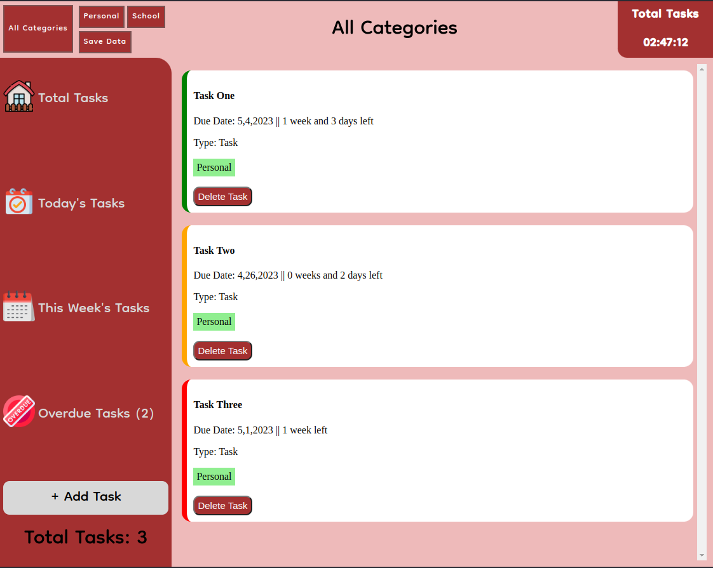

# TodoApp:

# Everything saves automatically don't Worry!

Its exactly what you think,

- Add tasks with ease
- Sort tasks by category
  > Finish what you need when you need to
- Add priority to the task and make it stand out
   
  
   
- Didn't finish a task? No worries take a look in `Overdue Tasks`
   

  
   

> Created by Michael Farabough
